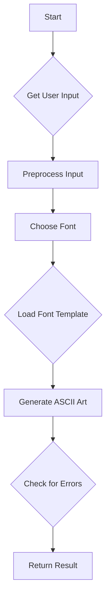

# ASCII Art Web Generator

## Description

This project creates a simple web server that generates ASCII art banners based on user input. User can choose from 3 preset fonts.

## Authors

- [Oleg Balandin](https://01.gritlab.ax/git/obalandi) & [Anastasia Suhareva](https://01.gritlab.ax/git/asuharev)

## Usage

To run the server:

1. Ensure you have Go installed on your system.
2. Clone the repository:
   ```
   git clone https://01.gritlab.ax/git/obalandi/ascii-art-web.git
   ```
3. Navigate to the project directory:
   ```
   cd ascii-art-web
   ```
4. Run the server:
   ```
   go run ascii-art-web.go
   ```
   or 
   ```
   go run .
   ```

5. Open a web browser and navigate to the homepage `http://localhost:8080`

6. Input may contain only [printable ASCII characters.](https://www.ascii-code.com/)

## Implementation Details

The ASCII art generation algorithm on the server side works as follows:



### Algorithm Explanation:

1. The server listens for incoming requests on port 8080.
2. When a request is received, it checks if the URL path is valid ("/" or "/ascii-art").
3. For GET requests to "/", it sets default input and font.
4. For POST requests to "/ascii-art", it retrieves user input and chosen font.
5. The input is preprocessed by replacing newlines with "\\n".
6. The appropriate font template is loaded.
7. ASCII art generation occurs by mapping characters to banner lines.
8. The generated ASCII art is checked for errors.
9. Finally, the result is returned to the client as HTML.
10. Error handling is implemented on various steps where errors may occur.

This approach allows for efficient handling of requests while providing users with a simple interface to create custom ASCII art banners.
